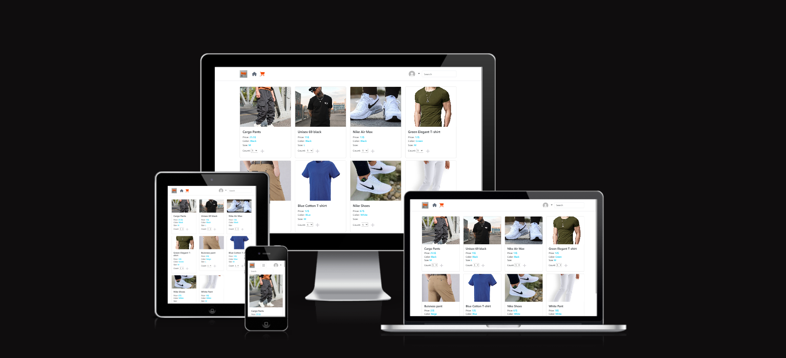

# E-Commerce project
An e-commerce website is an online platform that allows businesses and individuals to buy and sell products or services over the internet. It acts as a digital storefront where customers can browse, select, and purchase items, often with a secure payment process. E-commerce websites are commonly used by a wide range of businesses, from small startups to large enterprises.

 

[Live Production](https://ebuy-frontend-fa9dc5581b28.herokuapp.com/products) 

 

 

## Table of Contents
### [User Experience](#user-experience-ux)
* [Project Goals](#project-goals)
* [Agile Methodology](#agile-methodology)
* [Target Audience](#target-audience)
* [First time user](#first-time-user)
* [Registered user](#registered-user)
### [Design](#design-1)
* [Color Scheme](#color-scheme)
* [Wireframes](#wireframes)
* [User Journey](#user-journey)
### [Security Features](#security-features-1)
### [Features](#features-1)
* [Existing Features](#existing-features)
* [Features Left to Implement](#features-left-to-implement)
### [Technologies Used](#technologies-used-1)
* [Languages Used](#languages-used)
* [Frameworks Used](#frameworks-used)
* [Programs Used](#programs-used)
### [Deployment and Local developement](#deployment-and-local-developement-1)
* [Local Developement](#local-developement)
* [Heroku Deployment](#heroku-deployment)
### [Testing](#testing-1)
### [References](#references-1)
* [Docs](#docs)
* [Content](#content)
* [Acknowledgments](#acknowledgments)

---

## User Experience (UX) Optimization
* Intuitive navigation: Ensure the site is easy to navigate, with a clear structure (categories, filters, etc.) that helps users find products easily.
* Mobile responsiveness: Ensure the website functions well on all devices, including mobile phones and tablets.
* Fast loading times: Optimize performance so pages load quickly, reducing bounce rates.
* Accessible design: Ensure that the website is accessible to all users, including those with disabilities.

### Project Goals
#####  Increasing Sales and Conversion Rates
* Streamlined checkout process: Make the checkout experience as simple and quick as possible to reduce cart abandonment.
* Multiple payment options: Offer different payment methods (credit cards, PayPal).

### Target Audience
* Luxury Shoppers: Customers looking for high-end, exclusive, or premium products (e.g., designer clothing, luxury watches, fine jewelry, and gourmet items).
* Pet Owners: Buyers looking for pet products, from food and toys to grooming and healthcare items.
* Looking for clothes

### First time user
* Customer can see or look for product and see information about product

### Registered user
* can Order
* can contact with our customer support team for any order issues
* can see their orders' history

## Design
* The website provides an intuitive menu structure which is easy to understand and accessible such as sign in - sign up and home page icon, in addition to search field at top which enable the customer from about products by category

### Color Scheme
* #2142b2 - #7177a1 - #ff9254 - #242a3d - #4d68c1 

## Security Features
### User Authentication

* Django Allauth is a popular authentication and authorization library for Django, which provides a set of features for managing user authentication, registration, and account management.

### CSRF Protection

* Django provides built-in protection against Cross-Site Request Forgery (CSRF) attacks. CSRF tokens are generated for each user session, and they are required to submit forms or perform state-changing actions. When a user logs out, the session and associated CSRF token are invalidated, making it difficult for an attacker to forge a valid request using a copied URL.

### Custom error pages

* 500 Error Page, provides user with a button the redirect to home page.

