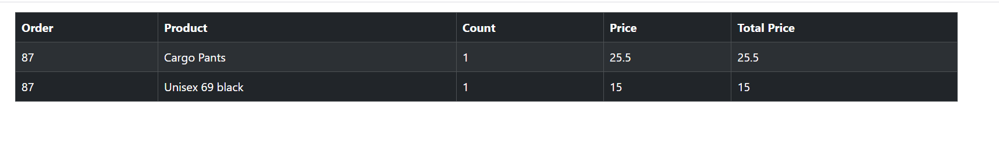

# E-Commerce project
An e-commerce website is an online platform that allows individuals to buy products over the internet. It acts as a digital storefront where customers can browse, select, and purchase items, often with a secure payment process. E-commerce websites are commonly used by a wide range of businesses, from small startups to large enterprises.

 

[Live Production](https://ebuy-frontend-fa9dc5581b28.herokuapp.com/products) 

 

 

## Table of Contents
### [User Experience](#user-experience-ux)
* [Project Goals](#project-goals)
* [Agile Methodology](#agile-methodology)
* [Target Audience](#target-audience)
* [First time user](#first-time-user)
* [Registered user](#registered-user)
### [Design](#design-1)
* [Color Scheme](#color-scheme)
* [Wireframes](#wireframes)
* [User Journey](#user-journey)
### [Security Features](#security-features-1)
### [Features](#features-1)
* [Existing Features](#existing-features)
* [Features Left to Implement](#features-left-to-implement)
### [Technologies Used](#technologies-used-1)
* [Languages Used](#languages-used)
* [Frameworks Used](#frameworks-used)
* [Programs Used](#programs-used)
### [Deployment and Local developement](#deployment-and-local-developement-1)
* [Local Developement](#local-developement)
* [Heroku Deployment](#heroku-deployment)
### [Testing](#testing-1)
### [References](#references-1)
* [Docs](#docs)
* [Content](#content)
* [Acknowledgments](#acknowledgments)

---

## User Experience (UX) Optimization
* Intuitive navigation: Ensure the site is easy to navigate, with a clear structure (categories, filters, etc.) that helps users find products easily.
* Mobile responsiveness: Ensure the website functions well on all devices, including mobile phones and tablets.
* Fast loading times: Optimize performance so pages load quickly, reducing bounce rates.
* Accessible design: Ensure that the website is accessible to all users, including those with disabilities.

### Project Goals
#####  Increasing Sales and Conversion Rates
* Streamlined checkout process: Make the checkout experience as simple and quick as possible to reduce cart abandonment.
* Multiple payment options: Offer different payment methods (credit cards, PayPal).

### Target Audience
* Luxury Shoppers: Customers looking for high-end, exclusive, or premium products (e.g., designer clothing, luxury watches, fine jewelry, and gourmet items).
* Pet Owners: Buyers looking for pet products, from food and toys to grooming and healthcare items.
* Looking for clothes

### First time user
* Customer can see or look for product and see information about product

### Registered user
* can Order
* can contact with our customer support team for any order issues
* can see their orders' history

---

## Design
* The website provides an intuitive menu structure which is easy to understand and accessible such as sign in - sign up and home page icon, in addition to search field at top which enable the customer from about products by category

### Color Scheme
* #2142b2 - #7177a1 - #ff9254 - #242a3d - #4d68c1 

### Wireframes

 Home Page on laptop before sign in 

 Home Page on laptop after sign in 

 Home Page on mobile before sign in 

 Home Page on mobile after sign in 

 Sign Up

 Sign In

 Checkout Order Details

 Checkout Address

 Checkout Payment Method

###

## Security Features
### User Authentication

* Django Allauth is a popular authentication and authorization library for Django, which provides a set of features for managing user authentication, registration, and account management.

### CSRF Protection

* Django provides built-in protection against Cross-Site Request Forgery (CSRF) attacks. CSRF tokens are generated for each user session, and they are required to submit forms or perform state-changing actions. When a user logs out, the session and associated CSRF token are invalidated, making it difficult for an attacker to forge a valid request using a copied URL.

### Custom error pages

* 500 Error Page, when there is no network with the server

## [Features]
* Navbar: In the navbar user have 4 options and search textbox  
    1. Home to move to home page where the reservation is found
    2. Cart icon to checkout
    3. Sign in to move to sign in page
    4. Sign up to move to sign up page
    5. Search textbox to search for products per category
 

 

* Products: In this section customer can find all the products  and information about each one ex:
Image - Name - Price - Color - Size
at the end of the products cart there is a plus icon which enables the costumer adding product with the selected count to the shopping cart.
 

 

 

* Sign up: the customer can create an account by filling out the form [ username - password - confirm password ]
 

 

* Sign in: the customer can sign in by filling out the form [ username - password ]
 

 

* Cart icon: After we add products to the cart a badge icon will be appear on the the shopping cart with the number of added items
 

 

* Checkout: After we add products to the cart customer presses on cart icon so checkout page is opened
    * First step is the order details so customer can see all the selected items with the info details and customer can alse change the count of the any product here by choosing any number from the select tag
 

 

* At the buttom of the Checkout page there is a button to proceed checkout

 

 

* Address: In the checkout process after the customer press on proceed he/she moves to address which is got from his profile

 

 

* Address: if customer want to ship the order to another address he/she clicks on the link To another address

 

 

* Address: this form is going to appear immediately if customer doesn't have an address or if he/she clicks on the link To another address 

 

 

* Payment Methods: The last step to checkout process. In this page customer chooses how to pay:
    1.  Visa card or master card: customer has to fill out the payment form and click pay
    2.  Paypal: paypal button must be click and the customer will be redirected to paypal website to login and then pay

 

 

 

* Order has been doen successfully: After the customer pays successfully, a success notification will appear and the customer will be redirected to the home page

 

 

* Recieve an E-Mail : If the customer provided an email, so after paying successfully the customer will receive an email with the following info:
    1. Order number
    2. Shipping Address
    3. Purchased items

 

 

* Orders : Customers can see all their orders history in a table includes info :
    * Created Date - Customer -	Total Price	- Details

 

 

* Order Details : Customers can see all items they buy for a specific order in a table includes info :
    * Order - Product - Count - Price - Total Price

 

 

* Footer : it includes icons to our social media like : Youtube - Facebook - Twitters - Instagram

 

 

## Technologies Used

### Languages Used

* [HTML5](https://en.wikipedia.org/wiki/HTML5)
* [CSS3](https://en.wikipedia.org/wiki/CSS)
* [JavaScript](https://en.wikipedia.org/wiki/JavaScript)

### Used Libraries
* [React JS](https://react.dev/) - Javascript library

### Frameworks Used

* [React Bootstrap](https://react-bootstrap.netlify.app/) - CSS framework

### Programs Used

* [Github](https://github.com/) - Storing the code online
* [Code Institute IDE](https://codeinstitute-ide.net/workspaces) - To create work space and write code
* [Heroku](https://www.heroku.com/) - Used as the cloud-based platform to deploy the site.
* [Figma](https://www.figma.com/) - Used to create wireframes and schemes
* [Am I Responsive](https://ui.dev/amiresponsive) - To show the website image on a range of devices.
* [Git](https://git-scm.com/) - Version control
* [Favicon Generator](https://realfavicongenerator.net/) - Used to create a favicon
* [JSHint](https://jshint.com/) - Used to validate JavaScript
* [W3C Markup Validation Service](https://validator.w3.org/) - Used to validate HTML
* [CSS Validation Service](https://jigsaw.w3.org/css-validator/) - Used to validate CSS
* [Stack over flow](https://stackoverflow.com/) - used to search for solutions to the programming problems

## Deployment and Local Developement

Live deployment can be found on this [View EBuy live website here](https://ebuy-frontend-fa9dc5581b28.herokuapp.com/products)

### Local Developement

#### How to Fork
1. Log in(or Sign Up) to Github
2. Go to repository for this project [E-Commerce](https://github.com/mohanadpro/e-commerce-frontend)
3. Click the fork button in the top right corner

#### How to Clone
1. Log in(or Sign Up) to Github
2. Go to repository for this project [E-Commerce](https://github.com/mohanadpro/e-commerce-frontend)
3. Click on the code button, select whether you would like to clone with HTTPS, SSH or GitHub CLI and copy the link shown.
4. Open the terminal in your code editor and change the current working directory to the location you want to use for the cloned directory.
5. Type the following command in the terminal (after the git clone you will need to paste the link you copied in step 3 above)
6. Set up a virtual environment (this step is not required if you are using the Code Institute Template in GitPod as this will already be set up for you).
7. Install the packages from the package.json using this command npm install
8. To run the project use npm run start command

### Deploy to Heroku 
    1. Create a Heroku account if you don't already have one here [Heroku](https://dashboard.heroku.com/).
    2. Create a new Heroku application on the following page here New [Heroku App](https://dashboard.heroku.com/apps)
    3. Go to the Deploy tab
    4. Link your GitHub account and connect the application to the repository you created.
    5. Go to the Settings tab
    6. Click "Add buildpack"
    7. Add the Python buildpacks in the following order
    8. Click Reveal Config Vars
    9. Add Config Vars
    10. Click Deploy Branch
    11. Click View to launch the application inside a web page.