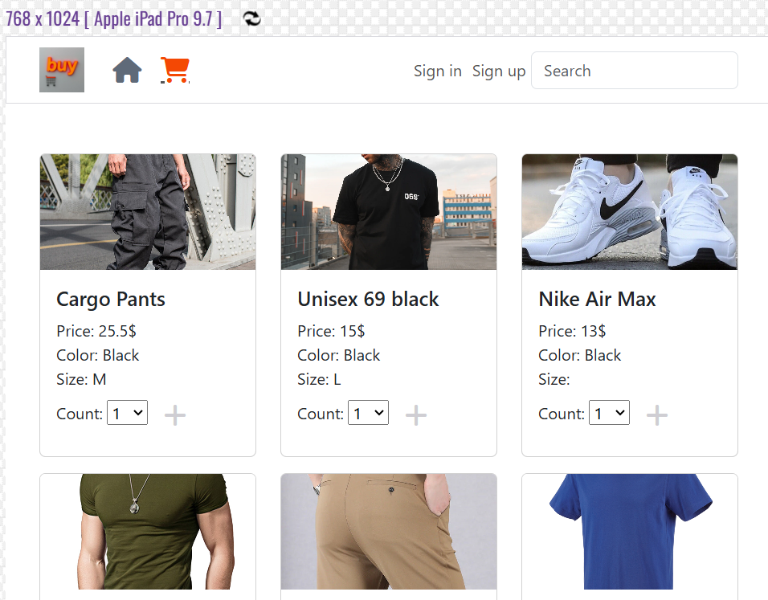

# EBuy online shopping system | Testing

Return to [README](README.md)
- - -
Comprehensive testing has been performed to ensure the website's seamless and optimal functionality.

## Table of Contents
### [Responsiveness Testing](#responsiveness-testing-1)
### [Browser Compatibility Testing](#browser-compatibility-testing-1)
### [Device Testing](#device-testing-1)
### [Code Validation](#code-validation-1)
* [HTML Validation](#html-validation)
* [CSS Validation](#css-validation)
### [Lighthouse Report](#lighthouse-report-1)
### [Bugs](#bugs-1)
* [Resolved Bugs](#resolved-bugs)
* [Unresolved Bugs](#unresolved-bug)
### [Features Testing](#features-testing-1)

---

## Responsiveness Testing

The deployed website underwent rigorous testing on multiple devices and screen sizes to ensure its responsiveness and adaptability. Developer Tools were utilized to simulate various screen sizes, enabling thorough examination of how the website behaves across different devices. Bootstrap classes and media queries were implemented to achieve the desired design, ensuring that the website maintains its visual and functional integrity on all platforms, enhancing the user experience.

 Laptop

 Tablet

 Mobile

