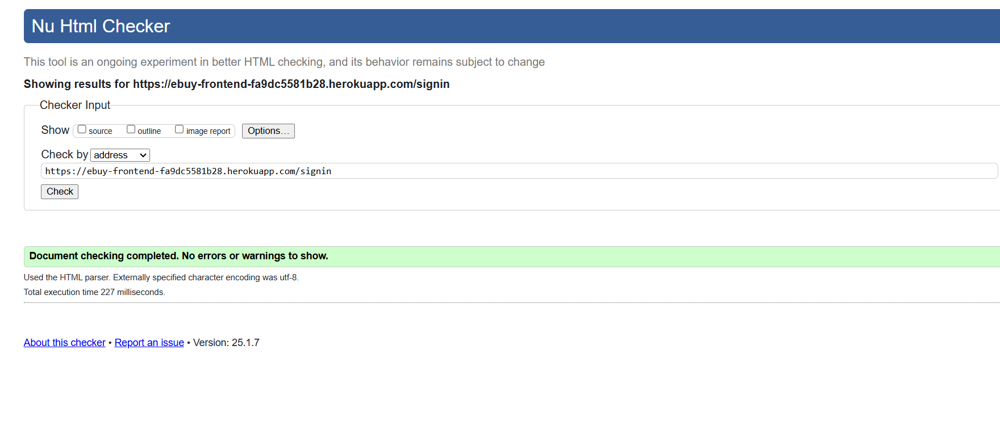

# EBuy online shopping system | Testing

Return to [README](README.md)
- - -
Comprehensive testing has been performed to ensure the website's seamless and optimal functionality.

## Table of Contents
### [Responsiveness Testing](#responsiveness-testing-1)
### [Browser Compatibility Testing](#browser-compatibility-testing-1)
### [Device Testing](#device-testing-1)
### [Code Validation](#code-validation-1)
* [HTML Validation](#html-validation)
* [CSS Validation](#css-validation)
### [Lighthouse Report](#lighthouse-report-1)
### [Bugs](#bugs-1)
* [Resolved Bugs](#resolved-bugs)
* [Unresolved Bugs](#unresolved-bug)
### [Features Testing](#features-testing-1)
### [Automated Testing](#automated-testing-1)
---

## Responsiveness Testing

The deployed website underwent rigorous testing on multiple devices and screen sizes to ensure its responsiveness and adaptability. Developer Tools were utilized to simulate various screen sizes, enabling thorough examination of how the website behaves across different devices. Bootstrap classes and media queries were implemented to achieve the desired design, ensuring that the website maintains its visual and functional integrity on all platforms, enhancing the user experience.

 Laptop

 Tablet

 Mobile

## Browser Compatibility Testing

The project was tested on multiple web browsers to check for compatibility issues and ensure it functions as expected across all of them. This testing process guarantees a smooth and consistent user experience, regardless of the browser used.

 Chrome

 Microsoft Edge

 Opera

 Mozilla

## Device Testing

Device testing was conducted on a variety of phone models, including Samsung Galaxy A52, Oppo, iPhone 12, Huawei. The assistance of family members and friends was sought to perform the testing. This comprehensive approach ensured that the website was thoroughly evaluated on different devices and platforms, contributing to a more robust and user-friendly final product.

## Code Validation

### HTML Validation

 Home Page

 Sign Up Page

 Sign in Page

 Profile Page

 Checkout Page

 Orders Page

### CSS Validation

 Home Page

 Sign In Page

 Sign Up Page

 Orders Page

## Lighthouse Report

 Home Page

## Bugs

### Resolved Bugs

#### Refused to deployed on Heroku 
* When I deployed the project to heroku I got 503 service is not available, but after contacting code institut tutors they helped me with the settings. it was an error in the Procfile and the package.json

#### Refresh token

 * It was an error when the user refresh the page, so all browser information were deleted, because of the token was not valid to I put an interceptor to the request to refresh the token if it's not valid 

#### Cart and address stay saved after logout

 * When the customer logout and another user login the selected items and address from the previous customer were found because they weren't cleared after the customer logout, so I fixed this issue by empty CartContext and AddressContext

### Unresolved Bug

#### Clear cart when refresh

* When the customer selects items and then refresh the page the items are gone.

## Features Testing
 
| Page          | User Action   | Expected Result  | Notes            |
|---------------|---------------|------------------|------------------|
| Navbar        |               |                  |                  |
|               | Click on Logo | Redirect to Home Page | PASS        |
|               | Click on Sign Up button | Redirect to Sign Up page | PASS |
|               | Click on Sign In | Redirect to Sign In page | PASS |
|               | Click on Home Icon | Redirect to Home Page  | PASS |
|               | Click on Cart Icon | Redirect to Cart Page  | PASS |
|               | Click on Cart Icon when user doesn't added any item | A toast message appeares for 2.5 second "You have put anything in the cart"  | PASS |
|               | A Logged in customer click on Sign out | Redirect to products page and his/her data deleted successfully | PASS |
|               | Search for items by category | Get a list of items when it's found  | PASS |
| Home          |               |                  |                  |
|               | Before items loaded | A loader appears in the middle | PASS |
|               | After items retrived | A loader disappears and 8 products display instead | PASS |
|               | When scroll down | Another items will be added to the products | PASS |
|               | After items retrived | A loader disappears and products displays instead | PASS |
|               | After items retrived | Each product displays as a card image in the top and info in the buttom with + icon | PASS |
|               | Choose number of purchased item and click on '+' icon | The item will be added to the cart and toaster success message appears and a budge icon will appears on the top of the shopping icon | PASS |
| Footer        |               |                  |                  |
|               | Click on social links in footer | Open new tab with appropriate link | PASS |
| Sign Up       |                  |                  |                  |
|               | Type invalid password | Must contain atleast 8 char | PASS |
|               | Type valid password | No error | PASS |
|               | Type password again (different) | Password must be the same | PASS |
|               | Click Sign Up with empty form | Fill in the form fields | PASS |
|               | Click Sign In if you have an account | Redirect to Login page | PASS |
|               | Fill all the form fields | Account created, alert message that you Signed in and redirected to profile page | PASS |
| Sign In       |                  |                  |                  |
|               | Click on Sign Up, if you don't have an account | Redirect to Sign Up page | PASS |
|               | Try invalid username | Username is not correct | PASS |
|               | Try invalid password | Password is not correct | PASS |
|               | Valid password and username | Redirect to products page | PASS |
|               | Click Sign In with empty form | Fill in the form fields | PASS |
| Checkout      |                  |                  |                  |
|               | Click on cart button when user is not signed in  | Redirect to the sign in page | PASS |
|               | Click on cart button when user is signed in | Redirect to checkout page | PASS |
|               | Change count of specific item | Total price is changed | PASS |
|               | Click on continue to checkout button | Address info appears, when customer has an address | PASS |
|               | Click on continue to checkout | Address Form appears, when customer doesn't have an address | PASS |
|               | Click on Add without filling out the address form | Please fill out the form , alert message appears | PASS |
|               | Click on Add with filling out the address form | Address info appears successfully | PASS |
|               | Click on continue to checkout button with an invalid address | A toast error message appears, The shipping address is not valid | PASS |
|               | Click on continue to checkout button with a valid address | Payment methods (visa card - master card - paypal) appear | PASS |
|               | Click on pay using master card and visa card without data | Please fill out the form , alert message appears | PASS |
|               | Click on pay using master card and visa card with valid card data | Success toast message, Your order has been done successfully and the customer will be redirected to home page and if customer has an email, he/she will receive an email with the order detail | PASS |
|               | Click on pay using paypal | Redirect customer to paypal website | PASS |
|               | Cancel payment using paypal | Error toast message, You have cancelled the payment  | PASS |
|               | error with payment using paypal | Error toast message, There was an error with the payment  | PASS |
|               | Make a success payment | Success toast message, Your order has been done successfully and the customer will be redirected to home page and if customer has an email, he/she will receive an email with the order detail  | PASS |
| Orders      |                  |                  |                  |
|             | Click on orders in the navbar | A table with orders history appears | PASS |
|             | Click on details to a specific order | A table with buyed items and details appear | PASS |

## Automated Testing

#### Sign In Page
- Test render username textfield and type in 
- Test render password testfield and type in 
- Test render sign in button
- Test click on sign in button when data is empty
- Test click on sign in button when credential is not correct
- Test click on sign in button when credentials is normal user 
- Test click on sign in button when credentials is admin user 
- Test render sign up link

 

 

#### Sign Up Page
- Test render username textfield and type in 
- Test render password testfield and type in 
- Test render confirm password testfield and type in
- Test render sign up button
- Test click on sign up button when data is empty
- Test click on sign up button when credentials have short password
- Test click on sign up button when password and confirm password didn't match
- Test click on sign up button when username is already exists
- Test click on sign up button when all provided data is correct
- Test render sign in link

 

 

#### Products Page
- Test Getting products from API

 

 

#### NavBar
- Test render logo icon if user is not logged in 
- Test disappear logo icon if user is logged in as admin
- Test disappear cart icon if user is logged in as admin
- Test render profile image 
- Test render username and move to profile image when it is clicked
- Test render oder link if user is logged in as normale user and move to order page when it is clicked 
- Test disappear order link if user logged in as an admin user 
- Test render home icon if user is not admin and when it is clicked, render products page
- Test disappear home icon if user is logged in a admin
- Test render cart icon and when it is clicked, render sign in page when user is not logged in
- Test render cart icon and when it is clicked, render checkout page if cart has products and user is logged in 
- Test render cart icon and when it is clicked and the cart is empty, stay in the same page
- Test render sign in link and when it is clicked, render sign in page
- Test render sign up link and when it is clicked, render sign up page

 

 

#### Footer

- Test render copy right with year
- Test render youtube icon and open youtube link when it's clicked
- Test render twitter icon and open twitter link when it's clicked
- Test render facebook icon and open facebook link when it's clicked
- Test render intagram icon and open instagram link when it's clicked

 

 

#### Profile
- Test check if profile image exists 
- Test if textfield with Username lable exists and customer is able to type in
- Test if emailfield with Email lable exists and customer is able to type in
- Test if textfield with Name lable exists and customer is able to type in
- Test if textfield with Country lable exists and customer is able to type in
- Test if textfield with City lable exists and customer is able to type in
- Test if textfield with State lable exists and customer is able to type in
- Test if textfield with Zio code lable exists and customer is able to type in
- Test if textfield with Street lable exists and customer is able to type in
- Test if numberfield with Street lable exists and customer is able to type in
- Test if update button exists
- Test get customer profile info when open profile link
- Test update profile info 

 

 

